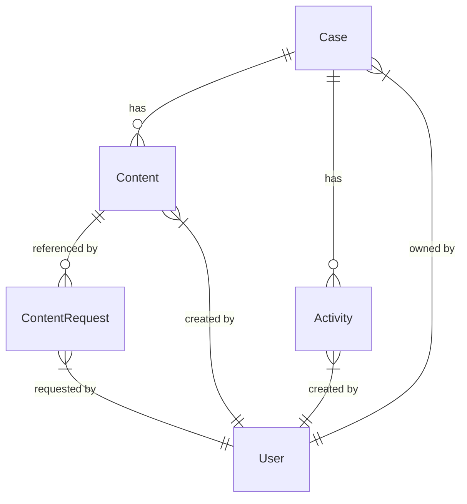

# Covet Documentation

Welcome to the Covet documentation.

## Data Model Overview

```mermaid
erDiagram
    Case ||--o{ Content : has
    Case ||--o{ Activity : has
    Content ||--o{ ContentRequest : "referenced by"
    Content }|--|| User : "created by"
    Case }|--|| User : "owned by"
    Activity }|--|| User : "created by"
    ContentRequest }|--|| User : "requested by"
```

## Documentation Sections

- [Data Models](./data-models/overview.md)

